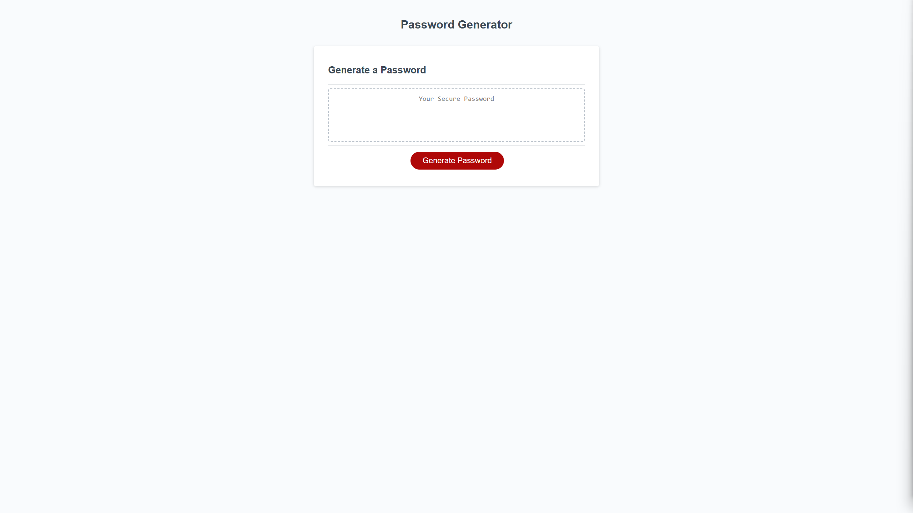
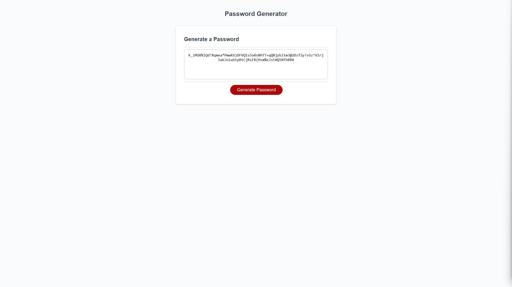
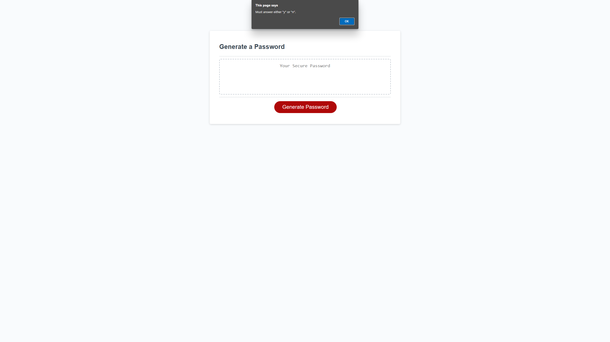

# Random Password Generator

## Description
An application to be used to generate random passwords based on criteria selected by the user. The user is prompted on whether to include the following character sets in their passwords:
* Numbers
* Lowercase letters
* Uppercase letters
* Special characters

Input validation is also incorporated in the generator. Prompts and messages will appear depending on user input. Examples of these prompts can be seen in the "Screenshots" section of this README.

## Screenshots

### Password Generator Home Screen

### Generated Password
Home screen of random password generation app.

### Invalid Password Length
An alert appears if the user chooses and invalid password length.

### Invalid User Reponse
An alert appears as shown below when user does not enter either "y" or "n".

## Deploy
This project can be visited by clicking on the following link:

